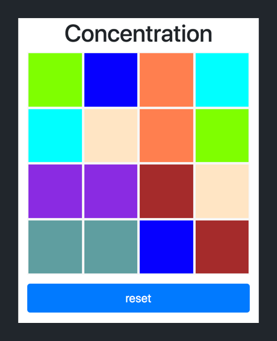

Welcome, welcome. You've reached the third tutorial of Make School's full-stack web series!

In this tutorial, we'll become friends with client-side JavaScript by building a game of concentration. We'll do the following:

1. Build the game UI using HTML, CSS, and Bootstrap
2. Implement the game logic with client-side JavaScript

In this tutorial, we'll focus on using our front-end technologies: HTML, CSS and client-side JavaScript. Our game will be played in the web browser and won't have a back-end. All code will be retrieved locally on our personal computer.

> [info]
>
Client-side JavaScript refers to JavaScript code that implements logic on our client (in our case, the browser.) We'll use JavaScript to implement our concentration game's logic. In the next tutorial, we'll start to learn about using JavaScript to build web apps that run on servers.

# What is Concentration?

The game of concentration involves a board containing an even number of squares. Each square in the grid has a color that matches another square in the board. However, the color of all squares are hidden. The goal of the game is to match the color of each square with it's matching pair.

Once the game starts, the player clicks on any square within the grid. Once clicked, the square will reveal it's hidden color.

The player then has the opportunity to reveal the color of another square. If the color of the second square matches the color of the first square, a match is made. If not, the colors of the two squares return to hidden and the player tries again.

The player tries to match all of the colored squares with their matching square as quickly as possible.

# Who Is This For?

Beginners who have some familiarity with using the following front-end technologies: HTML, CSS, JavaScript and  Bootstrap.

## What You Should Already Know

This tutorial builds on key concepts from the first two Make School tutorials.

You should know:

- how to build static webpages with HTML, CSS, and Bootstrap

If you can't, it's recommended to first complete or review the previous Make School tutorials.

## Estimated Completion Time

4 hours

# What We're Building

In this tutorial, we'll build a game of concentration.

If you've been searching for one of those classic, old-school games to distract you from everything you should be doing, this one's for you! (Please play responsibly.) 

Let's take a look at what our game will look like when it's complete:

To review the rules of gameplay: a player reveals the color of two squares at a time. If the color of the chosen squares are the same, a match is made. If not, the color of the square return to hidden. The game is won when the player matches every square with it's matching pair in the board.

You can preview the finished concentration game in the browser here:

<!-- TODO: turn into github page with the concentration game -->

# What You'll Learn

By the end of this tutorial, you will:

- become more familiar with programming in JavaScript
- manipulate the DOM using client-side JavaScript
- learn to think through and implement more complex logic 
- utilize the Chrome DevTools for debugging client-side JavaScript

# If You Get Stuck

Getting stuck when coding (and debugging) is a natural part of the programming process. If you find yourself stuck on a problem or lost, pause for a moment and take a breath. Maybe take a walk. Then retrace your steps (in the tutorial, not the walk.) Make sure you've followed each step of the tutorial. It's easy to make typos or accidentally skip over important steps.

If you want to compare your code to the solution, you can find it here:

<!-- TODO: insert link to github repo -->

