To start, we'll setup our developer environment and create a new project.

<!-- TODO: add review for what a dev env is -->

We'll be using the same set of tools we previously learned about:

- Atom: writing code
- Chrome: viewing and interacting with our UI
- Chrome DevTools: debugging and testing our game

You'll need to make sure you have both _Google Chrome_ and the _Atom_ text editor installed. If you've completed the previous tutorials, you will have done through this already. 

> [info]
>
If you don't have the required software installed, make sure you download and install the missing software before proceeding.

With the correct tools, let's create a new project for our codebase.

# Setting Up a New Project

Whenever you're creating a new front-end project, you'll need to repeat the following steps:

> [action]
>
Open the Atom text editor and create a new file:
>
1. Create a new file by pressing the shortcut `CMD-n` or selecting the _New File_ command in the _File menu_. 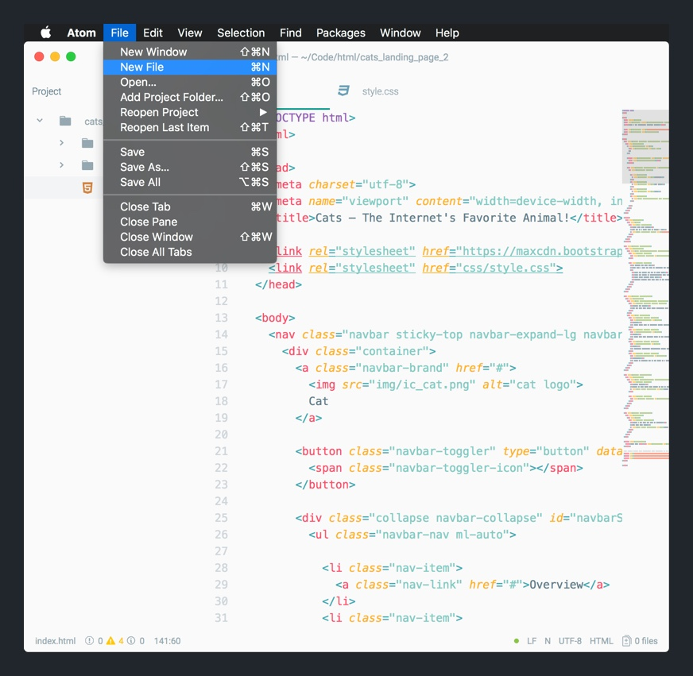
1. Save the new _untitled_ file you just created by pressing the shortcut `CMD-s` or selected the _Save_ command in the _File menu_. 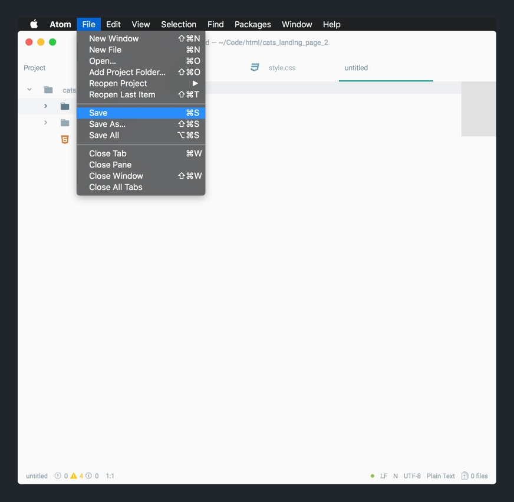
1. In the prompt, find a easy-to-find file path (i.e. `~/Code/html/`) on your computer to save all the files for your soon-to-be concentration game. Create a new project folder called `concentration` that will contain all your project-related files. 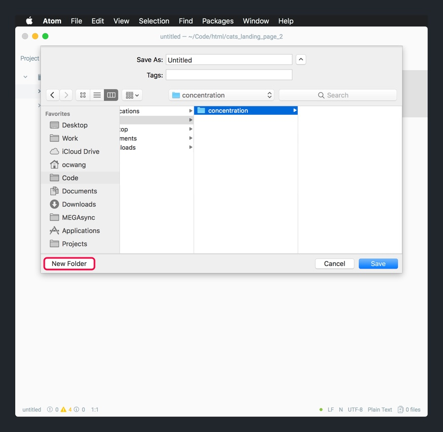
1. Save your new file with the name `index.html`. It's important to include the extension `.html`. 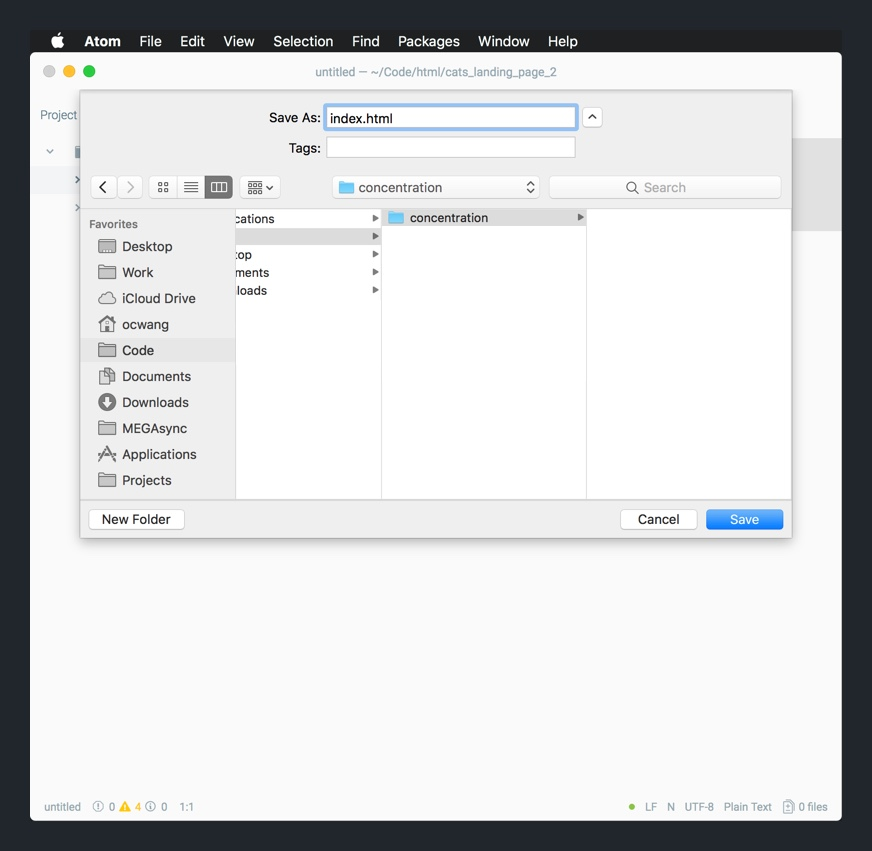
1. Click the `Save` button to finish creating your new `index.html` file and enclosing project folder. 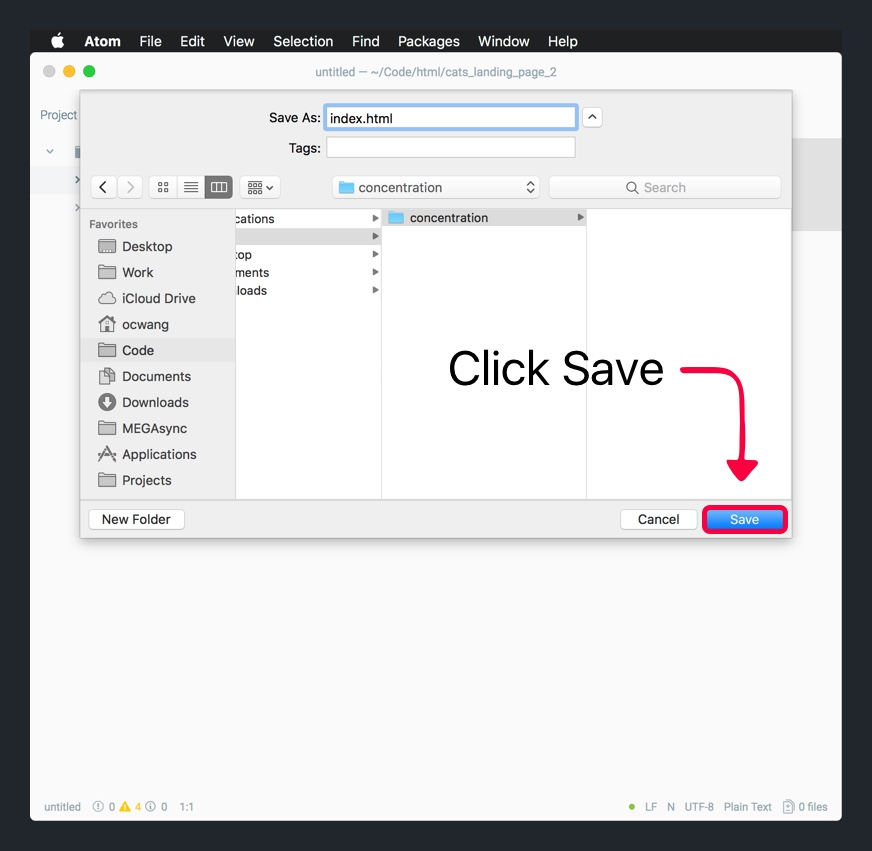

You've now created a new project folder with a empty `index.html`. This will be the home of our new concentration game.

Next, let's make sure our Project Tree View is showing the correct project.

> [action]
>
Let's make sure our Tree View has the correct project shown:
>
1. Close the Atom window (don't quit the entire application) by clicking the red X in the left-hand corner. 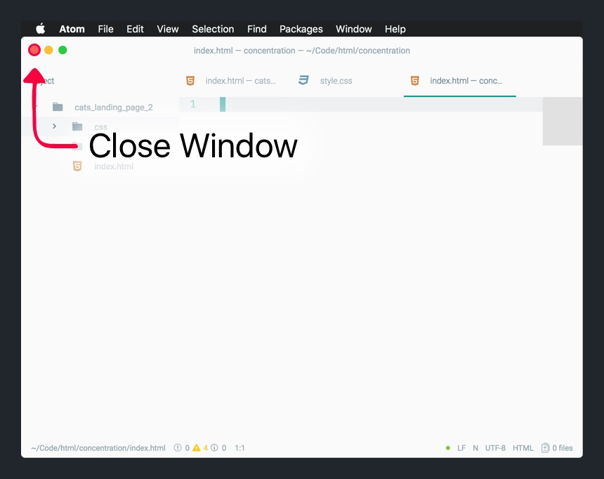
1. In the Atom _File menu_, select _Reopen Project_ to open your concentration project. 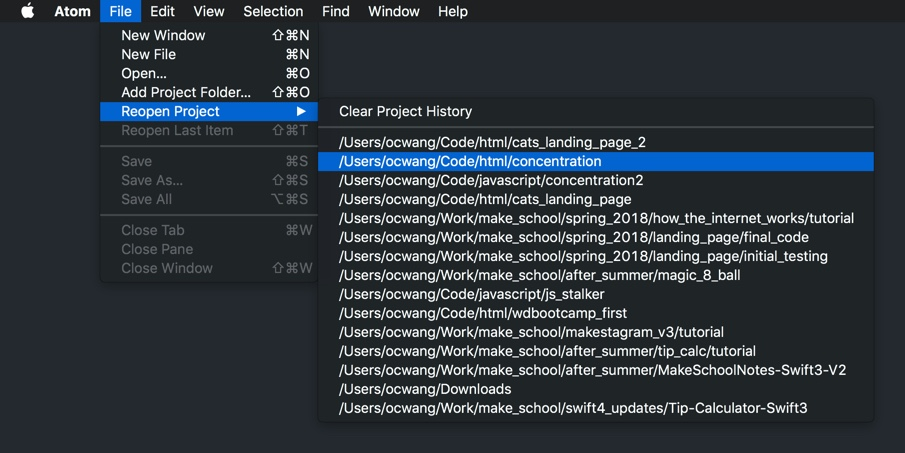

Once you're finished, you should see your `concentration` project folder and your new `index.html` file in the Atom editor Tree View.

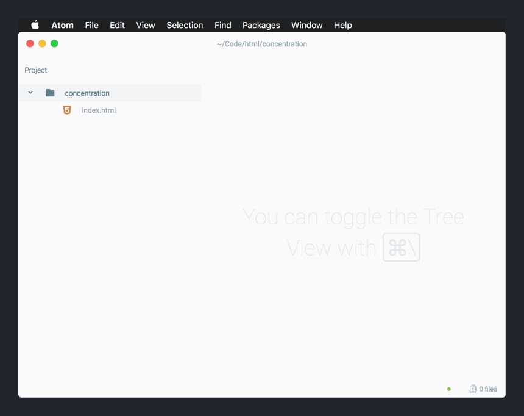

Next, we'll add the boilerplate HTML code and Bootstrap to our `index.html`.

# New HTML File Boilerplate

`Hello, World!` is always a good place to start. The Bootstrap docs will make this extremely easy for us.

> [action]
>
Using the Bootstrap documentation's [starter template](http://getbootstrap.com/docs/4.0/getting-started/introduction/#starter-template), setup the code for an initial `Hello, World!` web page.
>
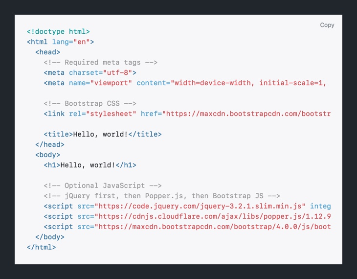

To make sure our HTML works, let's open it in the browser.

Remember how?

> [challenge]
>
In your Chrome web browser, open your concentration `index.html` in a new tab.

<!-- break -->

> [solution]
>
To open your HTML document in Chrome, follow the steps below:
>
1. Open the _Tree View_ in _Atom_ if it's not open already. You can toggle the _Tree View_ with the shortcut `CMD-\` or selecting the command under the _View menu_. 
1. With your _Tree View_ open, right-click on your `index.html` file. In the contextual menu that pops up, click on `Copy Full Path`. 
1. Open a _New Tab_ in _Google Chrome_ and paste the full file path into the address bar. 
1. Once your `index.html` file path is in the address path, hit the _Return_ key and you should see your `Hello, World!` web page. 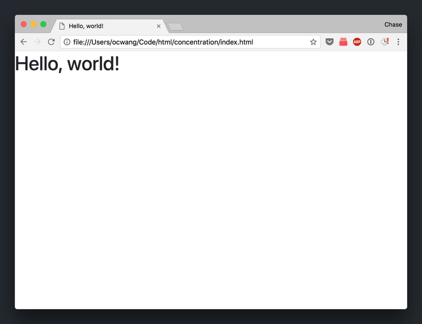

Off to a good start.

# Setting Up CSS

To finish our initial project setup, we'll also need to add our CSS and JavaScript.

We'll start with CSS.

> [action]
>
1. Create a new folder in your `concentration` project folder named `css`.
1. Create a new file in your `css` folder named `style.css`.

Your Tree View should look like:

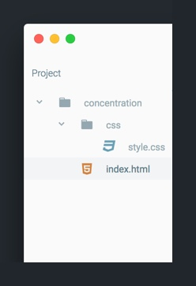

Back in `index.html`, we'll need to link our new stylesheet.

> [action]
>
In `index.html`, add the following tag inside your <head> element:
>
```
<head>
  // ...
>
  <link rel="stylesheet" href="css/style.css">
</head>
```

To make sure our CSS is properly connected, let's test it out.

> [action]
>
In your new `style.css`, add the following CSS rule:
>
```
h1 {
  color: orange;
}
```

Refresh your HTML doc in your browser and you should see `Hello, World!` in orange. 

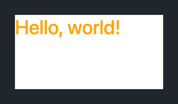

If you see your `<h1>` in orange, you can rest assured that your CSS is properly linked. If not, go back through the previous steps again.

Next, we'll need a place to store our script files that we'll use to code our concentration game.

# Configuring JavaScript

Similar to our CSS, we'll want to create a new file where we can write JavaScript. Then, we'll need to link our script back to our HTML document.

Let's create our first script file:

> [action]
>
1. Create a new folder in your `concentration` project folder named `js`.
1. Create a new file in your `js` folder named `main.js`.

When you're done, your Atom Tree View should look like the following:

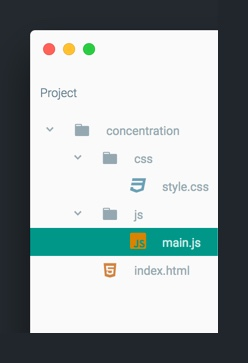

Like our CSS file, we'll need to link to `main.js` from our HTML document.

> [action]
>
In `index.html`, add the following `<script>` element below Bootstrap's scripts but before the closing `<body>` tag:
>
```
<body>
  <!-- ... previous HTML content -->
  <!-- ... Bootstrap scripts -->
  
  <!-- add line below -->
  <script src="js/main.js" charset="utf-8"></script>
</body>
```

Finally, we'll want to test that our HTML doc is correctly configure with our new script file. To do so, we'll use Chrome's DevTools.

## Using the JavaScript Console

To see if our `main.js` script is properly connectly to our HTML document, we'll need to switch back to our browser. First, we'll need to open our DevTools window.

> [action]
>
Navigate to your Chrome browser. With your `index.html` web page open, open the Chrome DevTools by pressing the shortcut `opt-CMD-i` or select the Developer Tools command in the _View > Developer menu_. 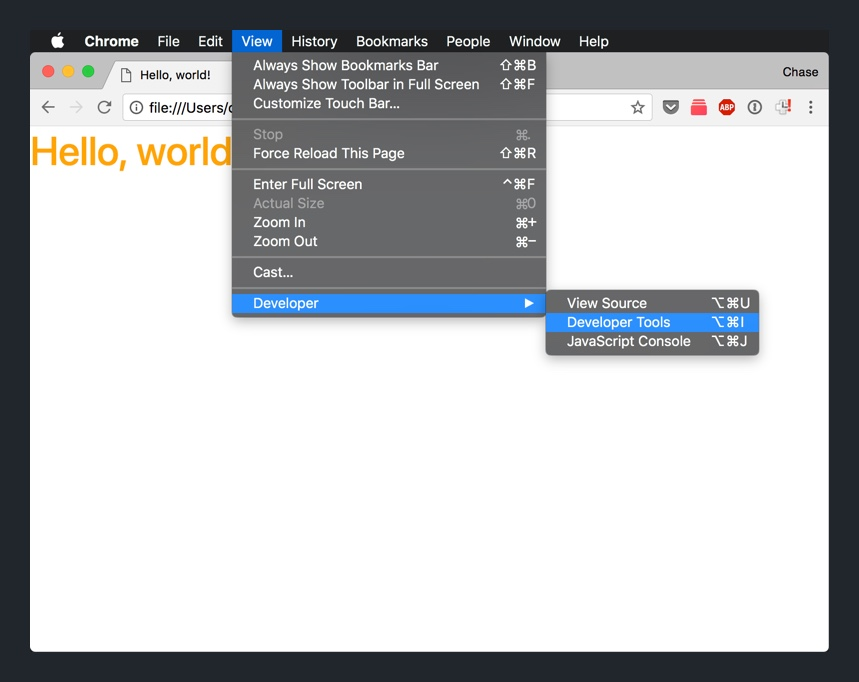

You'll either see a the DevTools open in a pane on your browser or in a new window.

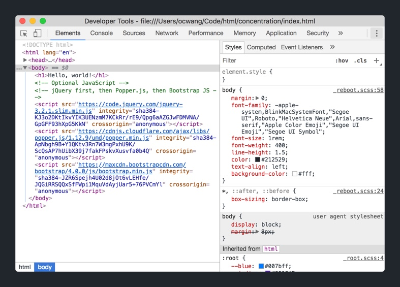

> [info]
>
If you want to change whether your DevTools is part of your browser or in a separate window, you can configure it the DevTool settings. 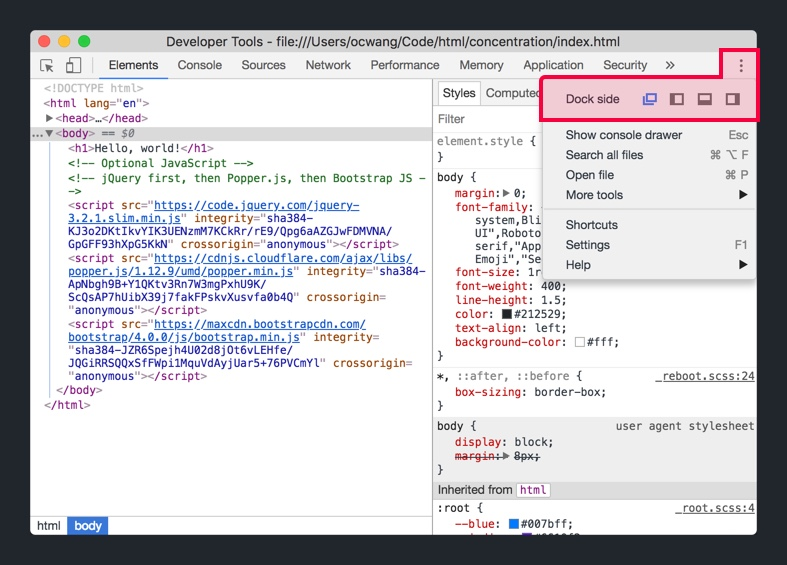

With our DevTools open, let's navigate to the JavaScript console.

> [action]
>
Click on the _Console_ tab of your DevTools. 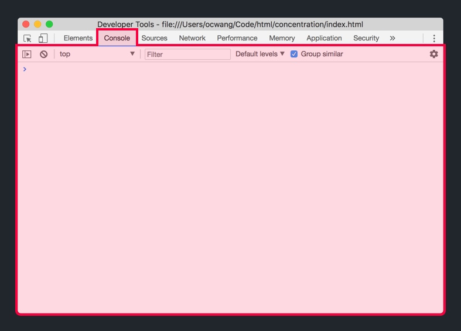

This is the JavaScript console. In it, you can write and test basic JavaScript. For example we can use `console.log()` to print text into the console.

Let's do that now.

> [action]
>
Write the following code in your JavaScript Console:
>
```
console.log('writing JavaScript in the console');
```
>
You should see the console print the text within the parenthesis: 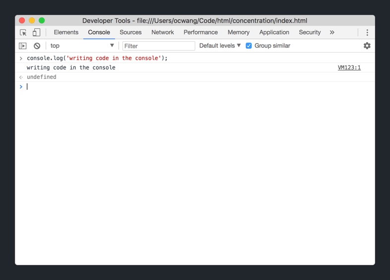

To test if our `main.js` script is connected to our `index.html` file, we can simply write JavaScript code in our `main.js` script and see if it's executed from the DevTools JavaScript Console.

> [action]
>
Open `main.js` in your Atom editor and add the following code:
>
```
console.log('writing JavaScript with Atom');
```
>
Make sure to save `main.js` after you add the code above.

Now, let's navigate back to our browser and refresh our web page. Keep an eye on your JavaScript console.

What happened? You'll notice that (if setup correctly) the code we wrote in `main.js` using our Atom text editor executed and was logged in our DevTools console.

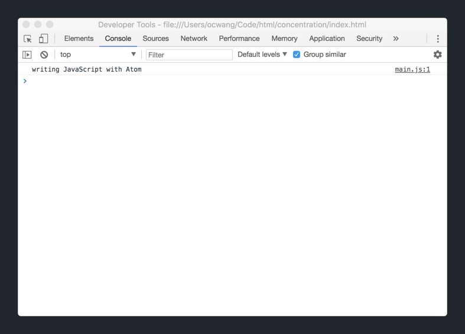

> [info]
>
If set up incorrectly, you won't see any text printed in your console. Try to retrace your steps and figure out what you're missing.

# Up Next

We've successfully set up our new project and the tools we'll use to build our game of concentration. In the next section, we'll start building the game's UI using our familiar friends HTML, CSS and Bootstrap.
