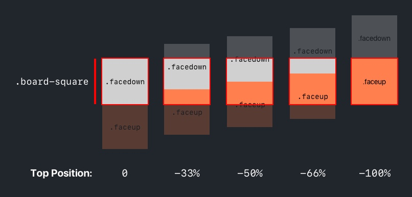

Let's start building. Throughout this section, we'll be focused on implementing the HTML and CSS for our game of concentration. When we're done, our game should look like the following:


But first, we'll need to get rid of our previous `Hello, world!` code.

# Clearing Test Code

After successfully verifying that our new project is properly configured, we'll no longer need `Hello, world` or any of the other code we added in `style.css` and `main.js`.

To start building our board, we'll reset and delete the `Hello, world!` boilerplate code in our project.

> [action]
>
In `index.html`, perform the following:
>
```
<!doctype html>
<html lang="en">
<head>
  <meta charset="utf-8">
  <meta name="viewport" content="width=device-width, initial-scale=1, shrink-to-fit=no">
>
  <link rel="stylesheet" href="https://maxcdn.bootstrapcdn.com/bootstrap/4.0.0/css/bootstrap.min.css" integrity="sha384-Gn5384xqQ1aoWXA+058RXPxPg6fy4IWvTNh0E263XmFcJlSAwiGgFAW/dAiS6JXm" crossorigin="anonymous">
>
  <!-- 1. Change Title Text -->
  <title>Concentration – A Test of Memory</title>
>
  <link rel="stylesheet" href="css/style.css">
</head>
>
<body>
  <!-- 2. Delete <h1> -->
>
  <script src="https://code.jquery.com/jquery-3.2.1.slim.min.js" integrity="sha384-KJ3o2DKtIkvYIK3UENzmM7KCkRr/rE9/Qpg6aAZGJwFDMVNA/GpGFF93hXpG5KkN" crossorigin="anonymous"></script>
  <script src="https://cdnjs.cloudflare.com/ajax/libs/popper.js/1.12.9/umd/popper.min.js" integrity="sha384-ApNbgh9B+Y1QKtv3Rn7W3mgPxhU9K/ScQsAP7hUibX39j7fakFPskvXusvfa0b4Q" crossorigin="anonymous"></script>
  <script src="https://maxcdn.bootstrapcdn.com/bootstrap/4.0.0/js/bootstrap.min.js" integrity="sha384-JZR6Spejh4U02d8jOt6vLEHfe/JQGiRRSQQxSfFWpi1MquVdAyjUar5+76PVCmYl" crossorigin="anonymous"></script>
  <script src="js/main.js" charset="utf-8"></script>
</body>
</html>

```
>
1. Delete the `<h1>` element that displays `Hello, world!`.
1. Modify the title text inside the `<title>` element of your `<head>` to `Concentration – A Test of Memory`.

Next, we'll need to remove the CSS we added.

> [action]
>
In `style.css`, delete all CSS rules so that your stylesheet is empty.

Finally, we'll remove the `console.log` that we added to our `main.js` script.

> [action]
>
In `main.js`, delete all JavaScript code so that your file is empty.

When you're done, your project, with exception of the HTML boilerplate and title, will be completely blank.

# Implementing the UI

For the rest of this section, we'll work on implementing the UI for our gameboard. When we're done, our game won't do anything, but it'll set the background for us to implement the code for concentration.

The design for our gameboard will be a 4x4 grid like such:


The height and width of the gameboard will always be 370px by 370px:


Finally, our gameboard will always take up the full 12 columns of the grid, but it will be centered regardless of the browser's width:


With those details, we can start writing the HTML for our gameboard. We'll need to start by position the gameboard with the correct layout.

> [action]
>
Create the `.container`, `.row`, and column `<div>` elements to position our gameboard:
>
```HTML
<body>
  <div class="container">
    <div class="row">
      <div class="col-12">
>
        <!-- TODO: add HTML for gameboard -->
>
      </div>
    </div>
  </div>
>
  <!-- ... existing scripts -->
</body>
```

Notice that we haven't added any of our UI code yet. So far, we've implemented the container, row and column needed to position our gameboard, but they're all empty `<div>` elements.

## Creating the Gameboard

If you look at the design of our gameboard, you'll see that it's a 4x4 grid.


To create our gameboard UI, we'll nest another grid within the current grid that we're using for positioning. Let's start by creating a new `.container` `<div>` for our gameboard's grid.

> [action]
>
Create a new `.container` `<div>` within your current grid:
>
```HTML
<div class="container">
  <div class="row">
    <div class="col-12">
>
      <!-- nested container for gameboard -->
      <div class="container">
>
      </div>
>
    </div>
  </div>
</div>
```

If you refresh your page right now, you still won't see anything, but we're getting there. We'll start by defining the size of our nested grid.

> [action]
>
Give your nested `.container` `<div>` a new class named `.board-container`:
>
```HTML
<!-- nested container for gameboard -->
<div class="board-container container">
>
</div>
```
>
With our new `.board-container` class, we'll select our `<div>` with CSS and give it the fixed width and height of our gameboard. In addition, we'll add a `background-color` property so we can see the area of our new container. In `style.css`, add the following CSS rule:
>
```CSS
.board-container {
  background-color: red;
  height: 370px;
  width: 370px;
}
```

Let's take a look. Refresh your web page in your browser. You should see the following:


If you adjust the width of your browser, you'll notice that our gameboard's container always remained centered in the middle of our outer grid.


Next, let's create a `.row` `<div>` within our `.board-container`.

> [action]
>
```HTML
<!-- nested container for gameboard -->
<div class="board-container container">
  <div class="row">
>
  </div>>
</div>
```
>
Similar to our `.board-container`, let's give our row a blue `background-color` so we can see the area of the `<div>`. In your stylesheet, add the following _descendant selector_:
>
```CSS
.board-container .row {
  background-color: blue;
}
```

However, if you refresh your web page, you won't see the blue area of your `.row` `<div>`. What happened?


Our `.row` `<div>` doesn't automatically assume the height of it's container `<div>`. To implement this behavior, we'll have to add a little more CSS.

> [action]
>
Give the `.row` container within your gameboard the same height it's container `<div>`:
>
```CSS
.board-container .row {
  background-color: blue;
  height: 100%;
}
```
>
The height percent (%) is based off of the height of the parent `<div>`. In this case, we give our `.row` 100% of the height of it's parent element. Which in our case, is the `.board-container` `<div>`.

Now, refreshing our web page, we can see the blue area of our row as expect.


Before we move further, let's go ahead and remove the `background-color` property for both the `.board-container` and it's `.row`. We've confirmed that each `<div>` is the correct size and position so we no longer need this CSS.

> [action]
>
Remove the `background-color` property for both the `.board-container` and it's `.row`:
>
```CSS
.board-container {
  height: 370px;
  width: 370px;
}
>
.board-container .row {
  height: 100%;
}
```

With our `.board-container` and `.row` container `<div>` complete, we'll want to start adding each of the gameboard's squares.

## Adding a Board Square

Let's look at how we're going to code each square in our 4x4 gameboard. We'll start by figuring out how to implement a single square:


Each square will be 1/4 of the width and height of our gameboard.

In addition, each square can be either faceup or facedown. The square's color is hidden or revealed depending on if it's facedown or faceup.


To imitate the behavior of a square having two faces, we'll do the following:

1. Inside each gameboard's square, we'll create a `.face-container` `<div>` that's double the height of each square. 
1. Within the `.face-container`, we'll add two `<div>` elements to represent each respective facedown and faceup state. 
1. The first `<div>` will cover the top half of the `.face-container` `<div>`. It'll be shown whenever the square is facedown. 
1. The second `<div>` in the `.face-container`, will cover the bottom half of the `<div>` element. It will be revealed when the square is faceup. 
1. We'll configure each square so that it can only show either the top or bottom half of the `.face-container`. This way, the square will always be either facedown or faceup. 

With knowledge about the mechanics of how our square will work, let's start building it. First, we'll need to create a column that's 25% the width of the grid. We can use Bootstrap's column sizes for this.

> [action]
>
Create a column that will be your gameboard square. This column should be 25% the width of the gameboard and have a class named `.board-square`:
>
```HTML
<!-- nested container for gameboard -->
<div class="board-container container">
  <div class="row">
>
    <!-- gameboard squares -->
    <div class="col-3 board-square">
>
    </div>
>
  </div>
</div>
```
>
We'll want to style our `.board-square` so that it's height is 25% of the gameboard. Add a CSS rule with the following declarations:
>
- Border: 2px solid red
- Height: 25% of row
- Padding: 0
>
```CSS
.board-square {
  border: 2px solid red;
  height: 25%;
  padding: 0;
}
```
>
We added a red border around our game square so that we can see it's area. We'll remove it later when we implement our final design.

Refresh your web page and you should see your gameboard's first square.


But we're not done yet. Next, we'll need to implement the `.face-container` `<div>` inside our square with each respective faceup and facedown `<div>`.

> [action]
>
Add a `<div>` inside your `.board-square` `<div>` with a class named `.face-container`:
>
```HTML
<!-- nested container for gameboard -->
<div class="board-container container">
  <div class="row">
>
    <!-- gameboard squares -->
    <div class="col-3 board-square">
      <div class="face-container">
>
      </div>
    </div>
>
  </div>
</div>
```
>
Next, we'll need to add some CSS so that our `.face-container` behaves as we expect it to. In addition, we'll add a temporary blue background color so that we can see the container `<div>` area.
>
```CSS
.face-container {
  background-color: blue;
  height: 200%;
  width: 100%;
}
```

<!-- TODO: explain CSS properties like position, top, and transition -->

Refresh your web page and you should see both the red border of the `.board-square` `<div>` and the blue background color of the `.face-container` area.


Within our `.face-container`, we'll need to add both a facedown and faceup for our gameboard's square.

> [action]
>
Within your `.face-container` `<div>`, add a `.facedown` and `.faceup` `<div>`:
>
```
<div class="col-3 board-square">
  <div class="face-container">
    <div class="facedown"></div>
    <div class="faceup"></div>
  </div>
</div>
```
>
We'll need to add some more CSS for our facedown and faceup `<div>` elements:
>
```CSS
.faceup, .facedown {
  height: 50%;
}
>
.facedown {
  background-color: lightGray;
}
>
.faceup {
  background-color: coral;
}
```
>
Since the parent container of our `.facedown` and `.faceup` `<div>` elements is 200% the height of our `.board-square` `<div>`, we set the height for both `.facedown` and `.faceup` `<div>` elements to 50%. In addition, we give both facedown and faceup `<div>` elements a temporary color so we can test that our code is working as expected.

Once again, refresh your web page in your browser. This time you'll see both the facedown and faceup colors of the gameboard square.


Last, we'll need to modify our square so that only one face (faceup or facedown) can be displayed at a time. To do this, we'll use a new property named `overflow`. This will hide any overflow content within our `.board-square` `<div>`.

> [action]
>
In your stylesheet, add the `overflow` property to your `.board-square` `<div>`:
>
```CSS
.board-square {
  /* ... previous CSS declarations */
>
  overflow: hidden;
}
```

Refresh your gameboard and you'll see that only the `.facedown` `<div>` shown in your `.board-square` `<div>`. 


The `.faceup` `<div>` is still there, it's just hidden because we specified that our `.board-square` should hide _overflow_ content.

# Implementing the Flip Transition

Throughout our game, squares will be flipped faceup and facedown. We'll handle the flipping of our board square using CSS.

Since each of our squares will have a `.faceup` and `.facedown` `<div>`, we'll flip between the two faces by changing the top position of our `.face-container`.


To implement the flipping transition, we'll need to be able to adjust the top position of our `.face-container`.

> [action]
>
In `style.css`, add the following CSS declarations to `.face-container`:
>
```CSS
.face-container {
  /* ... previous CSS declarations */
>
  position: absolute;
  top: 0;
}
```
> By setting our `position` to `absolute`, we can now adjust the `.face-container` vertical position easily by changing the `top` property.



Remember, the percent (%) is based on it's container element, in this case the `.board-square` `<div>`.

Next, we'll create a new CSS rule that will set the top position to `-100%` when applied to it's respective HTML element.

> [action]
>
In `style.css`, add the following CSS rule:
>
```
.flipped .face-container {
  top: -100%;
}
```
>
Notice that our new rule has a higher CSS specificity value than our CSS rule for `.face-container`. This will ensure that if applied, our `.flipped .face-container` selector will have precedence.

To finish up, we'll add the `transition` property to create a smoother animation when a square is flipped from facedown to faceup and vice versa.

> [action]
>
In `style.css`, add the following declaration to your existing `.face-container` CSS rule:
>
```
.face-container {
  /* ... previous CSS declarations */
>
  transition: 400ms;
}
```

With our new CSS, whenever the `.flipped` class is applied to our `.board-square` `<div>`, the `.faceup` `<div>` of our `.face-container` will be revealed.

Let's try it now.

> [action]
>
In `index.html`, add the `.flipped` class to your `.board-square` `<div>`:
>
```
<div class="col-3 board-square flipped">
  <div class="face-container">
    <div class="facedown"></div>
    <div class="faceup"></div>
  </div>
</div>
```

Refresh your browser and take a look. 


As expected, our `.faceup` `<div>` is revealed in our `.board-square` and the `.facedown` `<div>` is hidden.

## Implementing the Remaining Squares

To implement the remaining squares, we could simple copy and paste the `.board-square` HTML and it's nested elements 15 more times. However, this would lead to a lot of unnecessary duplication and would be hard to maintain if we wanted to make changes in the future. Instead, we'll move onto the next section to learn how to create the remaining squares in our gameboard using JavaScript.

# Cleaning Up

Before moving onto the next section, let's do some cleanup. We added some extra, unneeded code to better understand what was going on in our browser. Since we're finished, let's remove that extra code.

> [action]
>
1. In `index.html`, remove the `.flipped` class from the `.board-square` `<div>` so that it returns to being `.facedown`.
1. In `style.css`, modify your `.board-square` border to have a color of `#F7F7F7`, instead of `red`.
1. In `style.css`, remove the `blue` background color from `.face-container`.
1. In `style.css`, delete the CSS rule setting a `coral` background color for the `.faceup` selector.
1. In `style.css`, change the background color of your `.facedown` selector from `lightGray` to `#D0D0D0`

When you're done, move onto the next section and we'll begin learning how to manipulate the DOM with client-side JavaScript.
