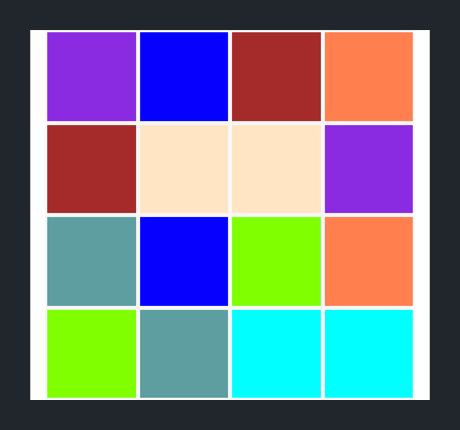

In the previous section, we worked on implementing the UI for our gameboard. You should have created a 4x4 grid gameboard with a single square.


In this section, we'll learn to write client-side JavaScript to generate our concentration gameboard.

# Intro to the DOM

The Document Object Model (DOM) is a representation of HTML that can be changed and manipulated with code. For us, that means we'll be able to write JavaScript code that dynamically changes our HTML and generates our gameboard in the browser.

> [info]
>
The DOM is a hard concept for beginners to grasp. We've greatly simplified our definition of the DOM to meet our needs. If you're interested in learning more about the DOM, check out the links below:
>
- [CSS Tricks](https://css-tricks.com/dom/)
- [W3](https://www.w3.org/TR/DOM-Level-2-Core/introduction.html)
- [Mozilla Developer Network](https://developer.mozilla.org/en-US/docs/Web/API/Document_Object_Model/Introduction)
- [Wikipedia](https://en.wikipedia.org/wiki/Document_Object_Model)

It's useful to generate our gameboard with code for the following reasons:

- We won't have to copy and paste the same code for each square 16 times.
- If we wanted to modify the HTML for our `.board-square`, we won't have to propogate those changes manually for each square.
- We can randomly generate a matching pair of colors for each `.board-square` in our gameboard.

By writing JavaScript, we can manipulate the DOM and dynamically add HTML that isn't in our `index.html` document.

## Manipulating the DOM

We'll start by generating the HTML for each of our 16 squares. To do so, we'll need to change the DOM and insert the following HTML for each of our 16 gameboard squares:

```HTML
<div class="col-3 board-square">
  <div class="face-container">
    <div class="facedown"></div>
    <div class="faceup"></div>
  </div>
</div>
```

We'll start by adding an `id` to the `.row` `<div>` of our gameboard. We'll need this to easily access the correct position in the DOM where we'll insert our 16 `.board-square` elements.

> [action]
>
Add the following `id` to the `.row` `<div>` of your gameboard:
>
```HTML
<!-- nested container for gameboard -->
<div class="board-container container">
  <!-- add gameboard id below -->
  <div id="gameboard" class="row">
>
    <!-- ... existing HTML for .gameboard square -->
>
  </div>
</div>
```

With our new `id`, we can access our `#gameboard` using the DOM. Let's access our `#gameboard` element and print it in the JavaScript console so we can better understand what's going on.

> [action]
>
Open your empty `main.js` file and add the following lines of code:
>
```
const boardElement = document.getElementById('gameboard');
console.log(boardElement);
```

Refresh your web page and navigate to your console (opt–CMD–j). If you expand the element printed, you should see the following:


See how we used JavaScript `document.getElementById` function to access the DOM and print the `#gameboard` element in our HTML document?

Next, we'll want to manipulate the DOM by adding extra code for our gameboard squares. Let's start by modifying the code within our `#gameboard` to insert a simple paragraph `<p>` element.

> [action]
>
In `main.js`, add the following code:
>
```JavaScript
const boardElement = document.getElementById('gameboard');
boardElement.innerHTML = '<p>changing the DOM</p>'
console.log(boardElement);
```
>
It's important to note that our `<p>` element is a `String` as it's enclosed within a matching pair of single quotes `'`. When you change the DOM with JavaScript, your HTML must be written as a `String`.

If you refresh the web page, you'll notice that our `.board-square` `<div>` has been replaced with a `<p>` element.


In addition, if you look in the JavaScript console, you'll see the DOM has been updated to the following:


We started by inserting a `<p>` element for example purposes. Now that we know how to change the DOM, we can move on to generating the HTML for the remaining squares of our gameboard.

# Generating a Single Square

We'll start off by trying to generate a single `.board-square` `<div>` using JavaScript. Let's give it a try.

> [challenge]
>
Using what we've learned so far, use JavaScript to change the DOM so that the `#gameboard` element contains a single `.board-square` (with all of it's children elements).

<!-- break -->

> [solution]
>
In `main.js`, we can use the following code:
>
```JavaScript
const boardElement = document.getElementById('gameboard');
>
boardElement.innerHTML =
  '<div class="col-3 board-square">\n' +
  '<div class="face-container">\n' +
  '<div class="facedown"></div>\n' +
  '<div class="faceup"></div>\n' +
  '</div>\n' +
  '</div>\n';
>
console.log(boardElement);
```
>
It's important to note that we use `String` concatenation and the newline `\n` character to format and organize the HTML we're trying to insert into the DOM.

If you refresh your browser again, you'll notice that our `#gameboard` contains a single `.board-square` `<div>`.


Although the code is identical to our original `index.html` HTML, we modified the DOM and replaced the original `.board-square` HTML content with an exactly identical one. To better understand what's going on, let's delete the `.board-square` `<div>` in `index.html`.

> [action]
>
Delete the existing `.board-square` `<div>` and it's children elements. When your done, your nested container should look like the following:
>
```
<!-- nested container for gameboard -->
<div class="board-container container">
  <div id="gameboard" class="row">
>
    <!-- generate board squares dynamically here -->
>
  </div>
</div>
```

Refresh the page, and you'll see that even with the `.board-square` HTML content in `index.html` removed, our code in `main.js` still generated a `.board-square` `<div>` element in our DOM.

## Generating the Remaining Squares

After generating our first board-square, we'll need to generate our remaining 15 squares to finish building our gameboard's HTML content.

See if you can figure out the code to generate 15 more identical `.board-square` `<div>` elements, including their children elements.

> [challenge]
>
In `main.js`, write JavaScript to generate a 4x4 grid of `.board-square` elements (16 total) with the following HTML content:
>
```HTML
<div class="col-3 board-square">
  <div class="face-container">
    <div class="facedown"></div>
    <div class="faceup"></div>
  </div>
</div>
```

<!-- break -->

> [solution]
>
To solve the challenge given, we can use a for-loop as follows:
>
```JavaScript
const numberOfSquares = 16;
let squaresHTML = '';
>
// generate HTML for board squares
for (let i = 0; i < numberOfSquares; i++) {
  squaresHTML +=
    '<div class="col-3 board-square">\n' +
    '<div class="face-container">\n' +
    '<div class="facedown"></div>\n' +
    '<div class="faceup"></div>\n' +
    '</div>\n' +
    '</div>\n';
}
>
// insert squares HTML in DOM
const boardElement = document.getElementById('gameboard');
boardElement.innerHTML = squaresHTML;
```

After refreshing the page, you'll notice that our board has successfully been built programmatically using JavaScript.


Before we move on, let's put the code we've written so far into a function to keep it a bit more organized.

> [action]
>
In `main.js`, modify your code to the following:
>
```JavaScript
function generateHTMLForBoardSquares() {
  const numberOfSquares = 16;
  let squaresHTML = '';
>
  // generate HTML for board squares
  for (let i = 0; i < numberOfSquares; i++) {
    squaresHTML +=
      '<div class="col-3 board-square">\n' +
      '<div class="face-container">\n' +
      '<div class="facedown"></div>\n' +
      '<div class="faceup"></div>\n' +
      '</div>\n' +
      '</div>\n';
  }
>
  // insert squares HTML in DOM
  const boardElement = document.getElementById('gameboard');
  boardElement.innerHTML = squaresHTML;
}
>
generateHTMLForBoardSquares();
```
>
Note that we call our function `generateHTMLForBoardSquares` on the last line of `main.js` for our function to execute.

Moving on, we'll work on turning each of our board squares into an array of `GameSquare` objects that we can use when implementing the logic for our game.

# Adding the GameSquare Object

Before we start building the game logic for concentration, we'll need to create objects that represent each board square. We'll do this by defining a new class named `BoardSquare` in `main.js`.

> [action]
>
In `main.js`, create a new JavaScript class by adding the following to the top of your script:
>
```JavaScript
class BoardSquare {
>
}
>
// ... existing code
```

Within our `BoardSquare` class definition, we'll need to add a constructor so we can create `BoardSquare` objects that represent each `.board-square` in our HTML document.

Some properties that we'll want to add and track in our `BoardSquare` class include:

- **element:** The DOM element of each respective `BoardSquare`. This will allow us to easily manipulate and change each element as the player plays the game.
- **color:** The faceup color of the `BoardSquare`.
- **isFaceUp:** Whether the `BoardSquare` is currently faceup or facedown.
- **isMatched:** Whether the `BoardSquare` has already been matched with it's pair that shares the same faceup color.

Initially, each `BoardSquare` class will contain an element and a color.

> [action]
>
In `main.js`, create a constructor that accepts an `element` and `color` as parameters:
>
```
class BoardSquare {
>
  constructor(element, color) {
    this.element = element;
    this.color = color;
  }
}
```

The color parameter will be a `String` of a CSS class with a `background-color` set.

Let's go ahead and create 8 color classes in our `style.css` stylesheet.

> [action]
>
In `style.css`, add the following to the bottom of your stylesheet:
>
```CSS
/* colors */
>
.color-0 {
  background-color: aqua;
}
>
.color-1 {
  background-color: bisque;
}
>
.color-2 {
  background-color: blue;
}
>
.color-3 {
  background-color: blueviolet;
}
>
.color-4 {
  background-color: brown;
}
>
.color-5 {
  background-color: cadetblue;
}
>
.color-6 {
  background-color: chartreuse;
}
>
.color-7 {
  background-color: coral;
}
```

These colors will be used to set the faceup color when generating each `.board-square` element.

Using these CSS classes, we'll need to modify our `BoardSquare` class to set it's respective color class in the DOM.

Let's create a new function that sets the color of each `BoardSquare` DOM element.

> [action]
>
In `main.js`, modify `BoardSquare` class definition to the following:
>
```
class BoardSquare {
>
  constructor(element, color) {
    this.element = element;
    this.setColor(color);
  }
>
  // 1
  setColor(color) {
    // 2
    const faceUpElement = this.element.getElementsByClassName('faceup')[0];
>
    // 3
    this.color = color;
    // 4
    faceUpElement.classList.add(color);
  }
}
```
>
Let's break down the code we added above:
>
1. Create a new function named `setColor` for some better organization and potential future reusablility.
1. Access the DOM element of the `.faceup` `<div>` for the respective `.board-square`.
1. Set the `BoardSquare` object with the new color class.
1. Add the CSS color class to the `.faceup` `<div>` DOM element to set the `.board-square` element's faceup color.

Next, let's quickly add the following `Boolean` variables to our object. We'll be using these to implement the game logic for our `BoardSquare` in the next section.

> [action]
>
In `main.js`, add a `isFaceUp` and `isMatched` boolean to your `BoardSquare` class:
>
```
class BoardSquare {
>
  constructor(element, color) {
    this.element = element;
    this.isFaceUp = false;
    this.isMatched = false;
    this.setColor(color);
  }
>
  // ... previous code
}
```

With our new `BoardSquare` class, we'll need to find a way to randomly generate matching pairs of colors for each `BoardSquare`. We'll implement that next.

# Randomly Generating Color Pairs

To randomly generate matching color pairs, we'll first create an array of all colors and their matching color pairs.

> [action]
>
In `main.js`, at the bottom of the file, add the following code:
>
```
const colorPairs = [];
>
function generateColorPairs() {
  if (colorPairs.length > 0) {
    return colorPairs;
  } else {
    // generates matching pair for each color
    for (let i = 0; i < 8; i++) {
      colorPairs.push('color-' + i);
      colorPairs.push('color-' + i);
    }
>
    return colorPairs;
  }
}
```
>
In the code above, we generate an array of matching pairs for each of our CSS color classes. Since concentration requires `BoardSquare` objects with matching faceup colors, we'll need to add two of each color to our array.

Next, we'll add some code that randomly shuffles an array of elements based on the Fisher-Yates algorithm. This will be a helper function that helps us randomly shuffle our matching colors.

> [action]
>
In `main.js`, add the following function to the bottom of your file:
>
```JavaScript
function shuffle(array) {
  let currentIndex = array.length;
  let temporaryValue, randomIndex;
>
  // While there remain elements to shuffle...
  while (0 !== currentIndex) {
    // Pick a remaining element...
    randomIndex = Math.floor(Math.random() * currentIndex);
    currentIndex -= 1;
>
    // And swap it with the current element.
    temporaryValue = array[currentIndex];
    array[currentIndex] = array[randomIndex];
    array[randomIndex] = temporaryValue;
  }
>
  return array;
}
```
>
You don't need to understand the specifics of what's going on in this function. Just know that it takes an array as input and returns the same element with it's elements shuffled as output.
>
If you're interested in learning more about the specifics of the Fisher-Yates algorithm, you can learn more details and even see a visualization by [clicking here.](https://bost.ocks.org/mike/shuffle/)

Next, we'll use the `generateColorPairs()` and `shuffle(array)` functions we created to return an array of shuffled colors.

> [action]
>
In `main.js`, create a function that returns a shuffled array of matching color pairs:
>
```JavaScript
function shuffleColors() {
  const colorPairs = generateColorPairs()
  return shuffle(colorPairs);
}
```

With our new color-shuffling functions, we can finally add a function that sets up our game so that we can begin writing our game logic.

# Implementing the Game Setup

So far, we have bits and pieces of the code that we'll need to initially set up our game. In this last step, we'll bring the code we've written together. We'll need to accomplish the following:

1. Create and insert the HTML elements of each `.board-square` in the DOM
1. Randomly shuffle and return 8 pairs of matching colors.
1. Create an array of `BoardSquare` objects for each respective `.board-square` element

We've already completed step 1, however let's refactor our code into a function named `gameSetup()`.

> [action]
>
In `main.js`, move the function call of `generateHTMLForBoardSquares()` into a new function named `gameSetup()`. Make sure this code is at the bottom of your `main.js` file.
>
```JavaScript
function setupGame() {
  generateHTMLForBoardSquares();
}
>
setupGame();
```

Next, we'll need to use our helper functions to generate an array of randomly shuffled color pairs.

> [action]
>
In `main.js`, use the `shuffleColors()` method to create a constant of randomly shuffled color pairs:
>
```JavaScript
function setupGame() {
  generateHTMLForBoardSquares();
>
  const randomColorPairs = shuffleColors();
}
```

Finally, we'll need to create each `BoardSquare` object from each `.board-square` element in our DOM.

> [action]
>
Create an array of `BoardSquare` objects using each `.board-square` element in the DOM:
>
```JavaScript
const boardSquares = [];
>
function setupGame() {
  generateHTMLForBoardSquares();
>
  const randomColorPairs = shuffleColors();
  // 1
  const squareElements = document.getElementsByClassName("board-square");
>
  // 2
  for (let i = 0; i < squareElements.length; i++) {
    const element = squareElements[i];
    const color = randomColorPairs[i];
    // 3
    const square = new BoardSquare(element, color)
>
    // 4
    boardSquares.push(square);
  }
}
```
>
Breaking down the code step-by-step:
>
1. We use `document.getElementsByClassName` to retrieve an array of all the `.board-square` elements in our DOM. We'll need these in order to create each `BoardSquare` object.
2. Using a for-loop, we loop through each `.board-square` element in our `#gameboard` to create it's respective `BoardSquare` object.
3. Create a new `BoardSquare` object using the DOM elements and shuffled colors at the specified position `i`.
4. Add the new `BoardSquare` object that was created into the `boardSquares` array.

At this point, we've finished implementing the setup for our gameboard. It's still not functional, and we won't be able to play concentration until our game logic is implemented, but let's take a look at what we've built so far.

Refresh your landing page and take a look at your gameboard.


If we want to verify the faceup colors are being shuffled and set for each of our `.board-square` elements, we can temporarily add the `.flipped` class to each `.board-square` `<div>` that we generate.

> [action]
>
In `main.js`, modify your `generateHTMLForBoardSquares()` function by adding the `.flipped` class to the HTML code of each `.board-square` `<div>`:
>
```JavaScript
function generateHTMLForBoardSquares() {
  const numberOfSquares = 16;
  let squaresHTML = '';
>
  for (let i = 0; i < numberOfSquares; i++) {
    squaresHTML +=
      // add .flipped class to <div> element
      '<div class="col-3 board-square flipped">\n' +
      '<div class="face-container">\n' +
      '<div class="facedown"></div>\n' +
      '<div class="faceup"></div>\n' +
      '</div>\n' +
      '</div>\n';
  }
>
  const boardElement = document.getElementById('gameboard');
  boardElement.innerHTML = squaresHTML;
}
```
>
Don't forget you'll need to remove the `.flipped` class from your code later. This is just for illustrative purposes to show that our gameboard setup is working properly.

When you're finished, refresh your web page and take a look:



To make sure your colors are being shuffled correct, refresh the pages a couple times. The color of each square should be randomized each time.


When you've verified that your gameboard is being setup properly, remove the `.flipped` class from your `generateHTMLForBoardSquares()` function in `.main.js`.

> [action]
>
In `main.js`, remove the `.flipped` class from being set in `generateHTMLForBoardSquares()` function:
>
```JavaScript
function generateHTMLForBoardSquares() {
  const numberOfSquares = 16;
  let squaresHTML = '';
>
  for (let i = 0; i < numberOfSquares; i++) {
    squaresHTML +=
      // remove .flipped class to <div> element
      '<div class="col-3 board-square">\n' +
      '<div class="face-container">\n' +
      '<div class="facedown"></div>\n' +
      '<div class="faceup"></div>\n' +
      '</div>\n' +
      '</div>\n';
  }
>
  const boardElement = document.getElementById('gameboard');
  boardElement.innerHTML = squaresHTML;
}
```

When you're done, refreshing your browser will return you back to your 16 gray, facedown boardsquares.

# Moving On

In this section, we learned about the DOM and how to manipulate it by dynamically generating the squares for our gameboard. Coming up next, we'll start building out the game logic so that we can start playing concentration!
