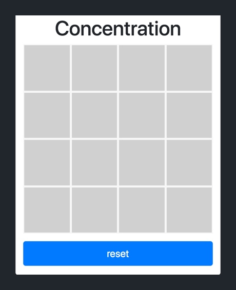
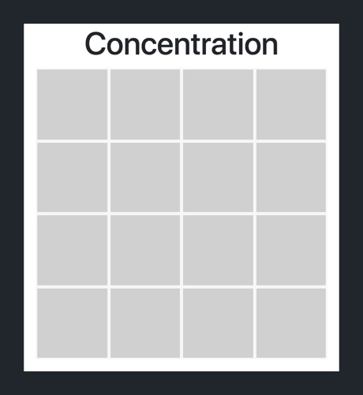
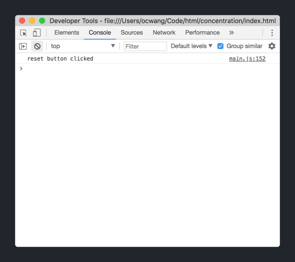

In the last section, we finished coding the logic for our game of concentration. In this section, we'll finish up the final touches in our design by adding a title `<h1>` and a reset button.

When we're done, we'll want our game to match the following:



Our section title `<h1>`, will give users a context what they're looking at.

The _Reset button_ will allow users to reset the game so they can play again at any moment. It'll re-shuffle the colors of each gameboard square and clear all existing matches.

Let's start with the easier of the two: the section title.

# Adding a Section Title

At this point, you should be familiar with HTML elements and how to create a new `<h1>` element. Let's do that now by adding a new section title to our web page.

> [challenge]
>
Add a section title `<h1>` element, right above the gameboard with the text `Concentration`. The text should be center aligned.
>


When you're done, check your solution below.

> [solution]
>
Within your outer `.container`, add the following `<h1>` element just before your `.board-container` `<div>`.
>
```
<body>
  <div class="container">
    <div class="row">
      <div class="col-12">
>
        <!-- add new h1 below -->
        <h1 class="text-center">Concentration</h1>
>
        <div class="board-container container">
>
          <!-- ... existing gameboard HTML -->
>
        </div>
      </div>
    </div>
  </div>
>
  <!-- ... scripts -->
>
</body>
```
>
To center our new `<h1>` element, we add the `.text-center` Bootstrap class.

# Adding a Reset Button

Next, we'll introduce a new HTML element: the `<button>`. We'll use a `<button>` to create a button that will be triggered to execute code in our `main.js` script whenever the user clicks on it.

Let's start with the HTML. We'll give it some of that built-in Bootstrap styling.

> [action]
>
In `index.html`, add a _Reset button_ right below the closing tag of your `.board-container` `<div>`:
>
```
<body>
  <div class="container">
    <div class="row">
      <div class="col-12">
        <h1 class="text-center">Concentration</h1>
>
        <div class="board-container container">
>
          <!-- ... existing gameboard HTML -->
>
        </div>
>
        <!-- add reset button below -->
        <button id="reset-button" class="btn btn-lg btn-primary btn-block">reset</button>
      </div>
    </div>
  </div>
>
  <!-- ... scripts -->
>
</body>
```
>
We've give our `<button>` an _id_ of `#reset-button` so that we can easily access it using the DOM in our JavaScript code. In addition, we've added some Bootstrap classes to give it some styling.

To finish up, we'll need to add a bit more CSS for our `#reset-button`.

> [action]
>
In `style.css`, add the following CSS rule so that your _Reset button_ is the correct width and centered within your outer `.container` `<div>`.
>
```CSS
#reset-button {
  margin: 15px auto 0;
  width: 370px;
}
```

When your done, your UI should match the design. Refresh your web page and you should see the following:


However, if you click on your _Reset button_, nothing happens. That's because we haven't added any code to happen when the user clicks the button. Let's implement that next.

## Handling Button Click Events

To handle _Click_ events from our `<button>` element, we'll need to add some additional code in our script file.

> [action]
>
In `main.js`, add the following JavaScript code:
>
```
// 1
const resetButton = document.getElementById("reset-button");
>
// 2
resetButton.addEventListener('click', () => {
  // 3
  console.log('reset button clicked');
});
```
>
Breaking down the steps in the code above:
>
1. Get a reference to the DOM element using the `#reset-button` id.
1. Add an event listener that monitors the element for `click` events.
1. Log `reset button clicked` to the JavaScript console each time a `click` event occurs.

Let's test this out.

> [action]
>
To see if our _Reset button_ is receiving and handling `click` events, do the following:
>
1. Refresh your web page.
1. Open the JavaScript console in Chrome DevTools by clicking `opt-CMD-j`.
1. Click on the _Reset button_ and see if the log is printed in the console.
>


When you've confirmed that your _Reset button_ is handling `click` events, we can move on to implementing the logic for resetting the game.

## Reset Game Logic

Let's create a new function that will reset our concentration game.

> [action]
>
In `main.js`, add the following code to the bottom of your script:
>
```JavaScript
function resetGame() {
  // 1
  firstFaceupSquare = null;
>
  // 2
  boardSquares.forEach((square) => {
    square.reset()
  });
>
  // 3
  setTimeout(() => {
    // 4
    const randomColorPairs = shuffleColors();
>
    // 5
    for (let i = 0; i < boardSquares.length; i++) {
      const newColor = randomColorPairs[i];
      const square = boardSquares[i];
>
      square.setColor(newColor);
    }
  }, 500);
}
```
>
Walking through each step together:
>
1. Reset the `firstFaceupSquare` variable back to `null`.
1. Use the `reset()` method of `BoardSquare` to set both `isFaceUp` and `isMatched` back to `false`, as well as setting each square back to facedown.
1. Use the `setTimeout()` function to delay the execution of the code within `setTimeout()` by 500 milliseconds. We do this because calling the `reset()` on each `BoardSquare` object will trigger the `.face-container` animation transition property. By delaying the shuffling of colors by 500ms, we don't interrupt the flipping animation.
1. Shuffle and randomize a new order for the color pairs.
1. Set each `BoardSquare` object in our `boardSquares` array with a new color based on our new shuffled colors.

Before we can move on, we'll need to add one additional line of code.

> [action]
>
In `main.js`, inside your `setColor()` method of your `BoardSquare` class, add the following line of code:
>
```JavaScript
class BoardSquare {
>
  setColor(color) {
    const faceUpElement = this.element.getElementsByClassName('faceup')[0];
>
    // remove the previous color if it exists
    faceUpElement.classList.remove(this.color);
>
    this.color = color;
    faceUpElement.classList.add(color);
  }
}
```
>
In the code above, we remove the previous color before setting a new color. We need to add this line of code since we're re-using the same `BoardSquare` objects when we reset our game.

Last, we'll modify the event listener to call the `resetGame()` function instead of logging text to the console.

> [action]
>
In `main.js`, modify your `addEventListener()` function to the following:
>
```JavaScript
resetButton.addEventListener('click', () => {
  resetGame();
});
```

Now, whenever our _Reset button_ is clicked, our concentration will be reset. Let's refresh our web page and test it out.


# Wrapping Up

Nicee! We've implemented the last feature of our concentration game. Feel free to celebrate by spending endless amounts of time playing your new favorite matching game. In the last section, we'll review what we've learned and discuss where to go from here.
