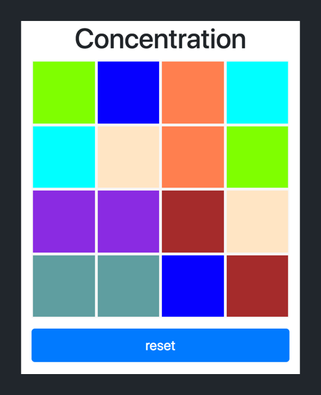

In this tutorial, we learned about client-side JavaScript and used our previous knowledge of HTML and CSS to build a game concentration.

Through the tutorial, we learned about many new concepts, especially in regards to using client-side JavaScript to build dynamic web pages. Along the way, you've picked up some new skills:

- become more familiar with programming in JavaScript
- manipulate the DOM using client-side JavaScript
- learn to think through and implement more complex logic 
- utilize the Chrome DevTools for debugging client-side JavaScript

We've also go to review front-end basics:

- building web pages with HTML elements
- styling HTML elements with CSS
- using Bootstrap's grid system to layout HTML content

Another web page built. You're well on your way to becoming an awesome full-stack developer (we'll still need to dive into back-end development which we'll do next).

Stop and take a moment to appreciate how far you've come!

## Where To Go From Here?

In the previous tutorials, we've only focused on front-end development. In the upcoming tutorials, we'll move onto back-end development and learning about how to build full-stack web apps.

> [info]
>
Keep in mind that as we move on from front-end development to back-end development, our focus will shift to more complex JavaScript logic and the NodeJS ecosystem. This means, in future tutorials, we won't cover as in-depth on HTML and CSS. 
>
If you ever feel like you need a refresher, refer back to this and the previous tutorials!
